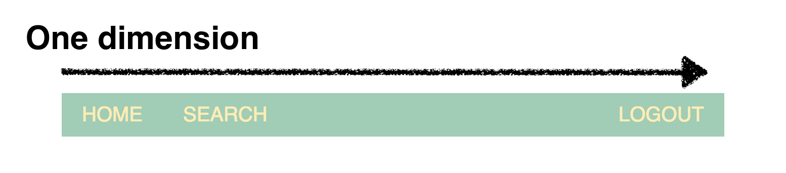
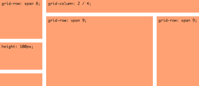
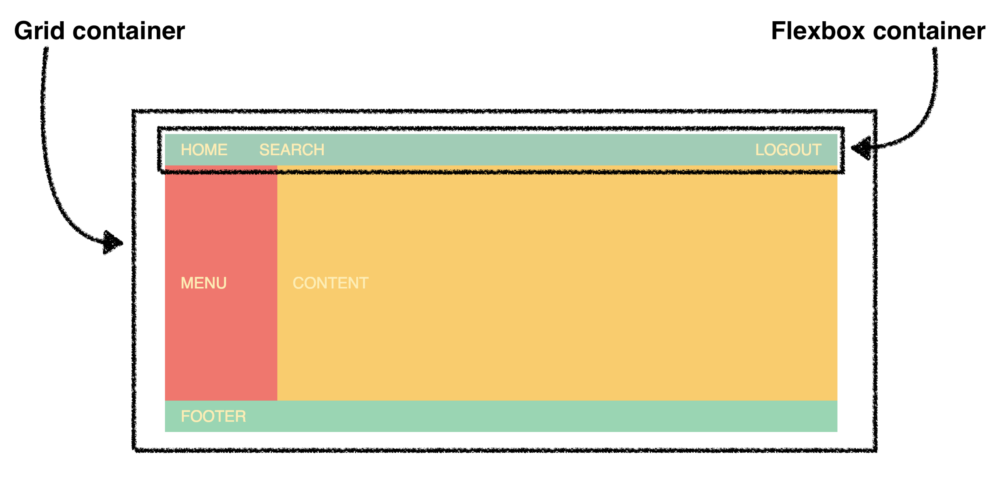

# css-grid-modern
CSS grid layout or CSS grid is a technique in Cascading Style Sheets that allows web developers to create complex responsive web design layouts more easily and consistently across browsers.

## Table of Contents
* What is CSS Grid?
* Grid Basics & Columns
* Grid Rows
* Sapnning Columns & Rows
* Auto-Fit & Minmax
* Grid Template Areas
* Media Queries & The Grid

---

### What is CSS Grid

Similar to flexbox(more powerful but a bit more difficult) - The biggest being that the grid is capable of two dimenstional layout.

CSS grid is a bit harder to use than flexbox but it's also more powerful and we can still use the same alignment properties that we've used with **Flex** wuch as `align-items` and `justify-content`.

As far as browser support, all browser support it with partial support from **Internet Explorer 11** for the grid system.

    

* `display: grid` - Creates a **grid**
* All direct child elements are **"grid items"**
* `grid-template-columns` defines width and numbers of columns

Because you understand the concepts of having a **container** and then having **items** within that container. And grid works the same way where we set a display property to a grid of a container, then all of the child elements become grid items then we can set a property called `grid-template-columns`, where we define the numbers of columns we want and the width.

We'll be introduceing a new unit of measure in CSS called `fr` or fractions.

<h3 align="center">Flex Box</h3>

    

Flexbox is not capable of two dimensional layout. Use it for a single row or columns. A good example would be a navbar, with a list of links set as rows horizontally.

<h3 align="center">CSS Grid</h3>

    

<h3 align="center">Grid Spanning</h3>

    

With the grid, you can have two dimensional layout, good for contents that you can span multiple columns and rows.

<h3 align="center">Combining both Flexbox and Grid</h3>

    

